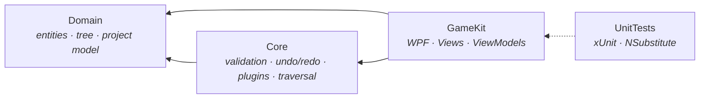

# GameKit

A desktop content editor for game data — items, quests and other authored entities — built in C# / WPF.

Game teams author thousands of small pieces of structured content: item stats, quest chains, loot tables. That content usually lives in hand-edited JSON or a spreadsheet, where a typo ships to players and nobody notices until QA. GameKit is a small, extensible editor for that content: designers work in a tree, every change is undoable, content is validated against rules before it leaves the tool, and the export format is a plugin so a studio can target whatever their engine actually reads.

<!-- TODO: replace with a 15s GIF: add entity → edit fields → validate → undo → export -->


## Features

- **Tree-based content editing** — entities form a composite tree; any entity can parent any other, so quests can own sub-quests and reward items.
- **Full undo/redo** — every mutation (edit, add, delete, move) is a command on a shared history stack, with a live history panel showing what will undo and redo next. `Ctrl+Z` / `Ctrl+Y`.
- **Rule-based validation** — validation rules are individually registered per entity type and composed by a generic validator. "Validate All" walks the whole tree and reports every failure at once.
- **Pluggable import/export** — the file format is an `IExportStrategy` implementation. JSON ships in the box; additional formats are dropped into a `Plugins` folder as assemblies and discovered at startup, with no changes to the application.
- **Re-parenting** — move an entity to a different parent (or to the root) from a picker dialog, as a single undoable operation.
- **Tree statistics** — entity counts by type across the whole project.

## Screenshots

<!-- TODO: 2–3 screenshots. Main window with a populated tree; the validation output; the export menu showing discovered plugins. -->

| Editing | Validation |
| --- | --- |
|  |  |

## Architecture

Four projects, with dependencies pointing inward. The UI can be replaced without touching the domain, and the domain has no idea WPF exists.



| Project | Responsibility |
| --- | --- |
| `Domain` | Entity types, the `ITreeNode` composite, and the serializable `Project` model. No dependencies. |
| `Core` | Validation rules and composition, the undo/redo command history, tree traversal, plugin loading, export strategies. |
| `GameKit` | WPF shell — views, view models, commands, DI composition root. |
| `UnitTests` | xUnit tests over the command history, move semantics and view model wiring. |

### Design decisions

**Undo/redo is a command stack, not a state snapshot.** Every mutation implements `IUndoableCommand` with `Execute`/`Undo` and a human-readable `Description`. Snapshotting the whole project on every keystroke would be simpler, but commands give a labelled history a designer can read, keep memory flat regardless of project size, and mean each operation defines exactly what "reverse" means for itself. Field edits are captured on focus-in and committed on focus-out, so typing a name produces one history entry rather than one per character.

**Export is Strategy, discovered by reflection.** `IExportStrategy` owns both directions of one format — `ExportAsync` and `ImportAsync` — so a format can never be half-supported. The registry is populated at startup from the built-in JSON strategy plus every strategy found in the `Plugins` directory. The export menu is bound to the registry, so a new plugin appears in the UI with no code change. The rationale is that studios don't share a content format; the tool shouldn't assume one.

**Validation is composed from single-purpose rules.** Each rule is an `IValidationRule<T>` doing exactly one check. `Validator<T>` takes every registered rule for a type and aggregates the failures, so adding a constraint means adding a class and one DI registration — not editing a growing validation method.

**Tree operations are traversals with pluggable behaviour.** Counting and validating are both "walk the tree, do something at each node", so they share a single traversal and differ only in the callback object. Adding a new whole-tree operation means writing one small class.

**MVVM with constructor injection throughout.** View models receive their collaborators through the DI container configured in `App.xaml.cs`; entity view models are produced by a factory so the tree can be rebuilt from a loaded project.

## Writing an export plugin

A plugin is a class library implementing `IExportStrategy`. Build it, drop the assembly into the `Plugins` folder next to `GameKit.exe`, and the format appears in the export menu on next launch.

```csharp
using Core.Plugins.Exporter;
using Domain.Projects;

public sealed class CsvExportStrategy : IExportStrategy
{
    public string FormatName    => "CSV";
    public string FileExtension => ".csv";

    public async Task ExportAsync(Project project, string filePath)
    {
        var lines = project.Entities.Select(e => $"{e.Id},{e.NodeType},{e.Name}");
        await File.WriteAllLinesAsync(filePath, lines.Prepend("id,type,name"));
    }

    public async Task<Project> ImportAsync(string filePath)
    {
        // ...parse and rebuild the project
    }
}
```

Requirements: a public, non-abstract type with a parameterless constructor.

## Project file format

Projects serialise to JSON with a type discriminator so the tree round-trips through polymorphic entity types.

```json
{
  "version": 1,
  "name": "Demo Project",
  "entities": [
    {
      "$type": "Item",
      "id": "0f8b...",
      "name": "Iron Sword",
      "value": 120,
      "description": "A serviceable blade.",
      "children": []
    }
  ]
}
```

## Getting started

Requires the [.NET 9 SDK](https://dotnet.microsoft.com/download) and Windows (WPF).

```bash
git clone https://github.com/<you>/GameKit.git
cd GameKit
dotnet build
dotnet run --project GameKit
```

Run the tests:

```bash
dotnet test
```

## Testing and CI

Tests use xUnit with NSubstitute for fakes, covering the undo/redo history, entity move semantics, and command execution against the view model layer. <!-- TODO: update once the GitHub Actions workflow is in -->  Every push and pull request runs `dotnet build` and `dotnet test` via GitHub Actions; merges to `main` are gated on a green run.

## Roadmap

Honest list of what isn't there yet, roughly in the order I intend to do it:

- Unsaved-change tracking, with a prompt before New / Open / Exit
- Search and filter across the entity tree
- Validation results as a dockable panel with click-to-navigate, replacing the modal dialog
- A reference CSV export plugin, shipped as a separate assembly, to exercise the plugin path end to end
- Cross-entity references (quest → reward item) with dangling-reference validation
- Drag-and-drop re-parenting in the tree
- Headless mode (`GameKit.exe --validate project.json`) so content can be checked in CI

## Built with

.NET 9 · WPF · CommunityToolkit.Mvvm · Microsoft.Extensions.DependencyInjection · Microsoft.Xaml.Behaviors · xUnit · NSubstitute
